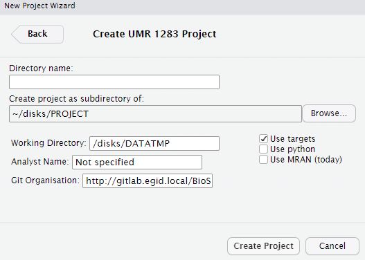

<!-- README.md is generated from README.Rmd. Please edit that file -->

# UMR 1283 - RStudio Project Templates 

<!-- badges: start -->

[](https://www.tidyverse.org/lifecycle/#experimental)
[](https://github.com/umr1283/umr1283)
<!-- badges: end -->

You can install `umr1283` from
[GitHub](https://github.com/umr1283/umr1283) with:

``` r
remotes::install_github("umr1283/umr1283")
```


