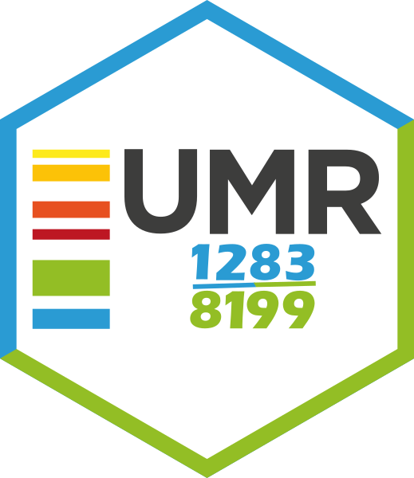

<!-- README.md is generated from README.Rmd. Please edit that file -->

# UMR 1283 - Project Template <a href='https://umr1283.github.io/umr1283'></a>

<!-- badges: start -->

[](https://www.tidyverse.org/lifecycle/#experimental)
[](https://github.com/umr1283/umr1283)
[](https://github.com/umr1283/umr1283/actions/workflows/check-pak.yaml)
<!-- badges: end -->

You can install `umr1283` with:

``` r
remotes::install_github("umr1283/umr1283")
```

The default project directory from `umr1283::create_project` (compatible
with RStudio Project Wizard) is as follow:

    .
    ├── data
    ├── docs
    ├── scripts
    │   └── _dependencies.R
    ├── reports
    ├── slides
    ├── outputs (symlink)
    ├── logs
    ├── renv
    ├── README.md
    ├── renv.lock
    └── project.Rproj

------------------------------------------------------------------------

## Getting help

If you encounter a clear bug, please file a minimal reproducible example
on [github](https://github.com/umr1283/umr1283/issues). For questions
and other discussion, please contact the package maintainer.

## Code of Conduct

Please note that the `umr1283` project is released with a [Contributor
Code of
Conduct](https://contributor-covenant.org/version/2/0/CODE_OF_CONDUCT.html).
By contributing to this project, you agree to abide by its terms.
