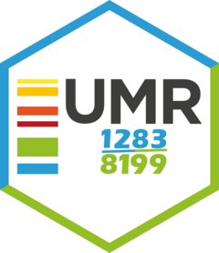

# UMR 1283 - Project Template <a href='https://umr1283.github.io/umr1283'></a>

<!-- badges: start -->
[](https://github.com/umr1283/umr1283)
[](https://github.com/umr1283/umr1283/actions/workflows/check-pak.yaml)
<!-- badges: end -->

You can install `umr1283` with:

``` r
remotes::install_github("umr1283/umr1283")
```

The default project directory architecture from `umr1283::create_project` (compatible
with RStudio Project Wizard) is as follow:

```r
library(umr1283)
create_project(path = "my-project")
```

```bash
.
├── README.md
├── _targets
├── _targets.R
├── my-project.Rproj
├── data
├── docs
├── logs
├── outputs
├── renv
├── reports
└── scripts
    ├── 00-targets.R
    ├── _dependencies.R
    └── tar-utils
```

------------------------------------------------------------------------

## Getting help

If you encounter a clear bug, please file a minimal reproducible example
on [GitHub](https://github.com/umr1283/umr1283/issues).  
For questions and other discussion, please open a discussion on
[GitHub](https://github.com/umr1283/umr1283/discussions).
